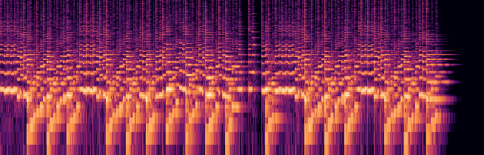

<p align="center">
  
</p>
<p align="center">
  
</p>

<p align="center"><strong>Audio as a pure function — procedural, deterministic, CI-testable.<br>Compose music in code, compile it once, render or run it byte-identically anywhere.</strong></p>

<p align="center">
  <a href="https://github.com/marmikshah/tono/actions/workflows/ci.yml"></a>
  <a href="https://crates.io/crates/tono-core"></a>
  <a href="https://docs.rs/tono-core"></a>
  
</p>

<p align="center">
  <a href="https://marmikshah.github.io/tono/">Showcase</a> ·
  <a href="https://marmikshah.github.io/tono/architecture.html">Architecture</a> ·
  <a href="https://docs.rs/tono-core">API docs</a> ·
  <a href="https://marmikshah.github.io/tono/guides/sound-effects">Cookbook</a>
</p>

<p align="center">
  
</p>

## Hear it

**[▶ The showcase site](https://marmikshah.github.io/tono/)** — Für Elise on
the sampled grand, a produced boom-bap track, the Nokia tune and other
recognizable classics, game-ready loops. Every track is a deterministic
render from song or sound data — nothing is a recording.

## 60 seconds to sound

```sh
cargo install tono
```

```sh
cat > blip.json <<'EOF'
{ "name": "blip", "duration": 0.3, "engine": 5,
  "root": { "type": "mul", "inputs": [
    { "type": "sine", "freq": 880 },
    { "type": "env", "a": 0.002, "d": 0.08, "s": 0.0, "r": 0.05 } ] } }
EOF

tono render blip.json -o out/
#   out/blip.wav          the audio
#   out/blip.png          spectrogram — look at your sound
#   out/blip.stats.json   peak/RMS/LUFS/spectral analysis
```

That's the author's loop: `--watch` re-renders on every save, `tono diff`
tells you what changed between two docs, `tono match REF.wav` scores a doc
against a recording, `tono fit` hill-climbs parameters toward it, and
`tono review` grades a sound against the ship checklist. Hear the built-ins
first: `tono catalog` lists the 31 voices, `tono presets` the 16 factory
sounds — each renders a demo you can inspect.

## Compose a song

A typed song API over the same engine — tracks from the instrument catalog,
patterns on a bar grid, tempo/meter maps, buses and automation — compiled
once into a hashed, validated **Program**:

```python
import tono

song = tono.Song("night-drive", tempo=122, seed=7)
drums = song.track("drums", tono.instruments.drums("tr808"))
bass = song.track("bass", tono.instruments.bass("finger"))

beat = tono.Pattern(bars=1)
beat.hit("kick", beats=[0, 2])
beat.hit("snare", beats=[1, 3])
riff = tono.Pattern(bars=1)
riff.notes(["C2", "C2", "Eb2", "G2"], durations=0.5)

song.arrange(drums, beat, bars=range(8))
song.arrange(bass, riff, bars=range(0, 8, 2))
song.automate(bass, "gain", [(0, 0.2), (8, 0.9)], curve="exp")

program = song.compile(sample_rate=48_000)
mix = program.render()          # stereo float32 — same bytes from Rust or Python
stems = program.render_stems()  # every track + bus, separate
```

The same Program **runs live** — commands land on exact frames, never when
your loop wakes up:

```python
with tono.Performance(program, headless=False) as perf:
    perf.play()
    perf.set_gain(0.8, at=tono.next_bar())         # rides the fader on the bar
    perf.transition("chorus", at=tono.next_bar())  # section swap, quantized
```

**Installs.** Rust: `cargo add tono-core` — the same song API
([example](crates/tono-core/examples/compose.rs),
[API docs](https://docs.rs/tono-core)). Python: [builds from
source](crates/tono-py) with maturin — no prebuilt wheels yet; two complete,
runnable songs live in [crates/tono-py/examples](crates/tono-py/examples)
(a produced 16-bar track, and Beethoven's Für Elise on the 3/8 meter map).

## Why tono

- **Sounds are data.** A sound is a JSON synthesis graph; rendering it is a
  pure function → byte-identical audio on every OS, and every document keeps
  its historical render forever, pinned by engine revision. Test it, diff
  it, cache it in CI.
- **Zero-asset SFX.** A patch renders infinite variations from gameplay
  parameters — impacts that scale with collision force, footsteps that vary
  by surface. No sample library.
- **A real music runtime.** Sample-accurate transport, quantized section
  transitions, stingers, crossfaded swaps — plus mixer buses, polyphony caps
  with priority stealing, and adaptive intensity stems.
- **An ear built in.** Every render returns a spectrogram, a waveform, and
  LUFS/spectral stats — "does it sound right?" becomes numbers and pictures.

## Where next

- **The guided first ten minutes** — the
  [quickstart](https://marmikshah.github.io/tono/get-started/quickstart).
- **Make sounds** — the [sound-effects
  guide](https://marmikshah.github.io/tono/guides/sound-effects): recipes,
  and how to judge a sound by its stats.
- **Embed in a game** — [run live &
  embedded](https://marmikshah.github.io/tono/guides/live): the Engine/Mixer
  runtime, parametric patches, adaptive music.
- **No code** — the desktop pattern station ([build it](crates/tono-desktop))
  or the speaker playground ([crates/tono-play/examples](crates/tono-play/examples)).

All guides: [the docs site](https://marmikshah.github.io/tono/). The codebase tour:
[architecture](https://marmikshah.github.io/tono/architecture.html).

## License

[MIT](LICENSE) — permissive, no warranty.
